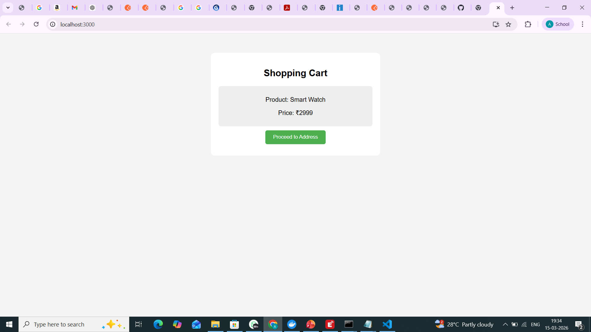

# Smart E-Commerce Checkout Workflow UI

## Project Description
This project is a React JS based user interface for a Smart E-Commerce Checkout Workflow.  
It simulates an online checkout process where users move through different steps like cart, address entry, payment selection, and order confirmation.

## Technologies Used
- React JS
- JavaScript
- HTML
- CSS
- Node.js
- npm

## Features
- Shopping cart page
- Address form
- Payment selection
- Order confirmation page
- Multi-step checkout workflow

## Checkout Workflow
Cart → Address → Payment → Confirmation

## Project Structure

ecommerce-checkout-ui
│
├── public
├── screenshots
├── src
│   ├── components
│   │   ├── Cart.js
│   │   ├── Address.js
│   │   ├── Payment.js
│   │   └── Confirmation.js
│   ├── App.js
│   ├── App.css
│   └── index.js
│
├── package.json
└── README.md

## Installation

Clone the repository

git clone https://github.com/Amrue320/ecommerce-checkout-ui.git

Go to project folder

cd ecommerce-checkout-ui

Install dependencies

npm install

Run the project

npm start

Application runs at:

http://localhost:3000

## Screenshots

## Author
Amruthesh S P  
Master of Computer Applications (MCA)
